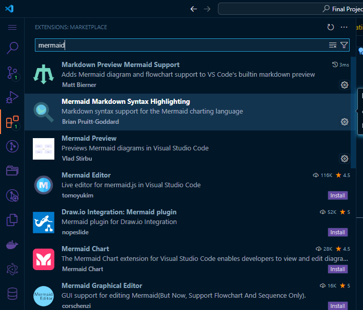

# To View Files install Extentions first 

To properly view the documents, the mermaid extention of visual studio code must be installed. 

I wanted to use code-to-diagram tools for creating models and flowcharts because I want 
to keep track of the changes of the models and diagrams. As for the documentation 
files, I would like to store them into git, but I am not sure about docx and pdf files - so 
I am currently working with Markdown files. 

I used Mermaid because it is simple and free, compared to alternatives - though it is limited in features.